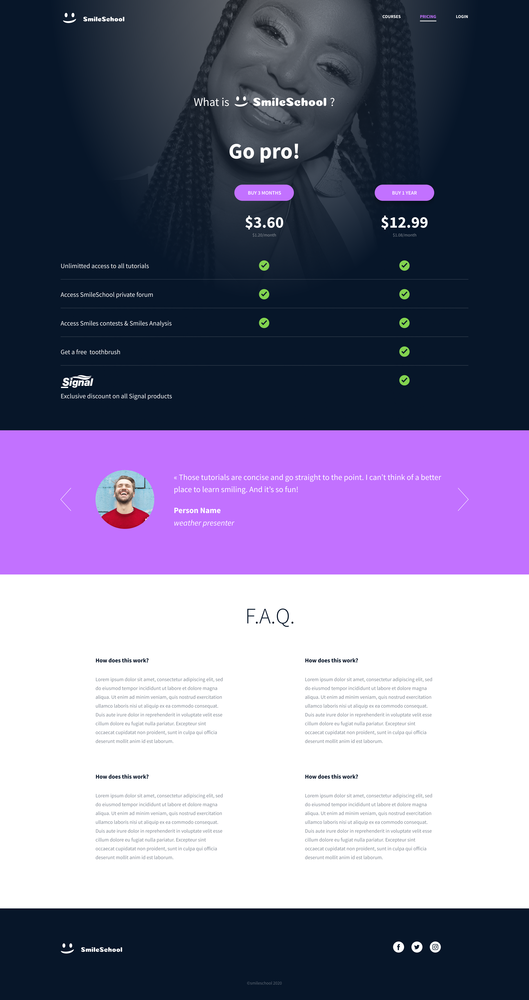
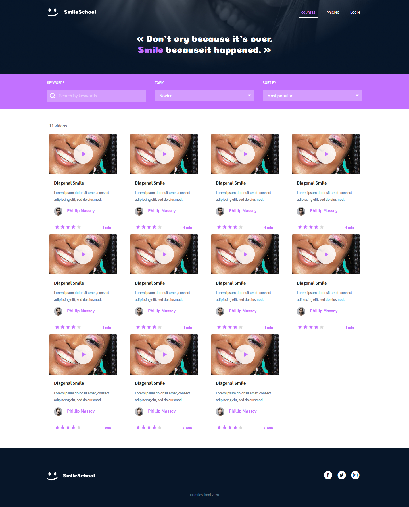

## Description

In this project, I implemented 3 web pages with Bootstrap. I used all HTML/CSS/Accessibility/Responsive design/Bootstrap knowledges that I learned previously
and I was free to implement it the way I wanted.

---
## Content
#### 1. Header first --> [HTML file](./0-homepage.html) - [CSS file](./styles.css)
#### 2. Carousel of quotes --> [HTML file](./1-homepage.html) - [CSS file](./styles.css)
#### 3. Popular videos --> [HTML file](./2-homepage.html) - [CSS file](./styles.css)
#### 4. Row of smiles --> [HTML file](./3-homepage.html) - [CSS file](./styles.css)
#### 5. Latest videos --> [HTML file](./4-homepage.html) - [CSS file](./styles.css)
#### 6. ... and the footer! --> [HTML file](./homepage.html) - [CSS file](./styles.css)
### **Final result Homepage**

#### 7. Pricing - header --> [HTML file](./0-pricing.html) - [CSS file](./styles.css)
#### 8. Prices grid --> [HTML file](./1-pricing.html) - [CSS file](./styles.css)
#### 9. Quotes section --> [HTML file](./2-pricing.html) - [CSS file](./styles.css)
#### 10. FAQ --> [HTML file](./3-pricing.html) - [CSS file](./styles.css)
#### 11. Close the page with a footer --> [HTML file](./pricing.html) - [CSS file](./styles.css)

### **Final result Pricing page**

#### 12. Courses - header --> [HTML file](./0-courses.html) - [CSS file](./styles.css)
#### 13. Search filters --> [HTML file](./1-courses.html) - [CSS file](./styles.css)
#### 14. List of result --> [HTML file](./2-courses.html) - [CSS file](./styles.css)
#### 15. Close the page with a footer --> [HTML file](./courses.html) - [CSS file](./styles.css)

### **Final result Courses page**

# Responsive desing
Rendering on screen of **max-width: 767px.**

Rendering on screen of **max-width: 480px.**

---

## Author
#### Luz Sánchez Bolaños
- Github: [zulsb](https://github.com/zulsb)
- Twitter: [@LuzSanchezB](https://twitter.com/LuzSanchezB)

Cohort 10 | Cali, Colombia 2020